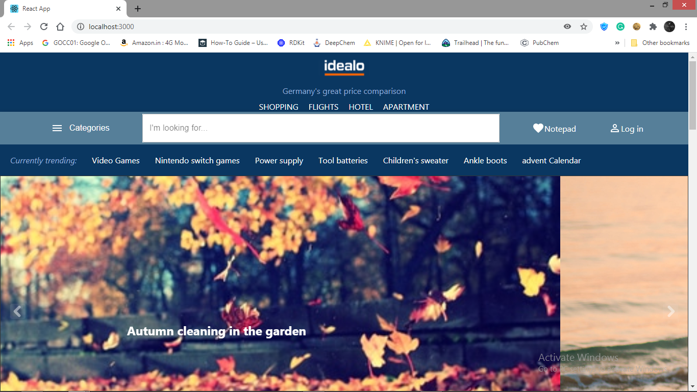
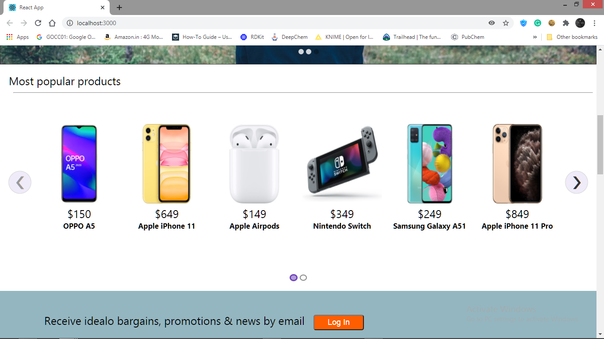
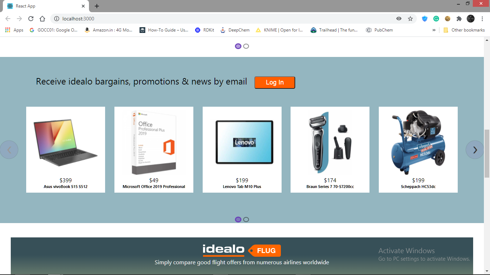
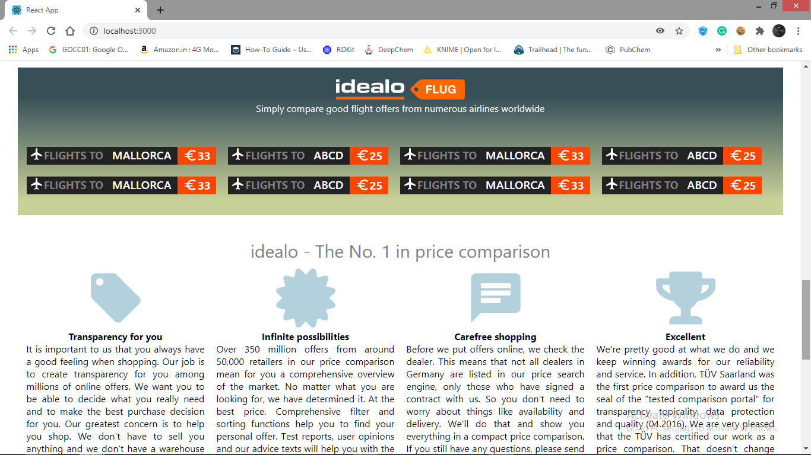
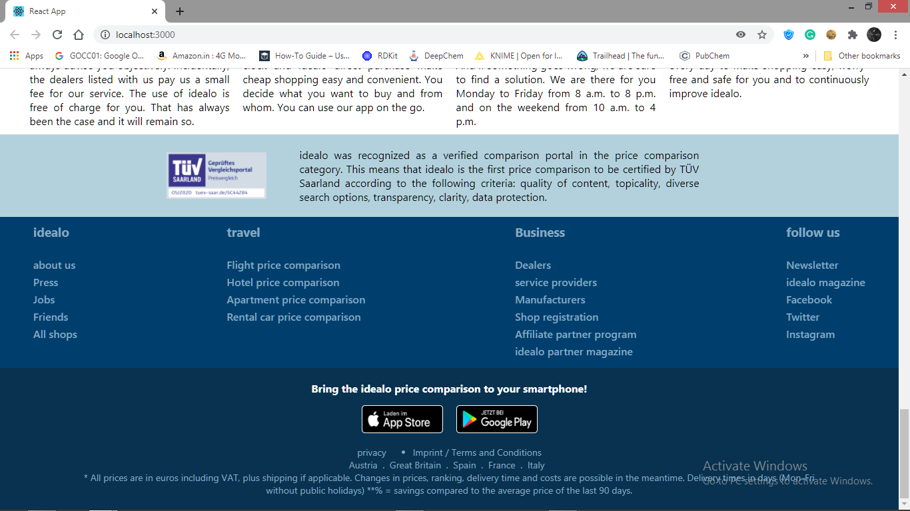

# idealo-clone
Idealo clone application developed using MERN stack and GraphQL
 
<b>Front end: <i>ReactJS</i></b> 
<b>Back end: <i>nodeJS</b></i> 
<b>Database: <i>MongoDB</b></i> 

<h1>OUTPUT: </h1>

